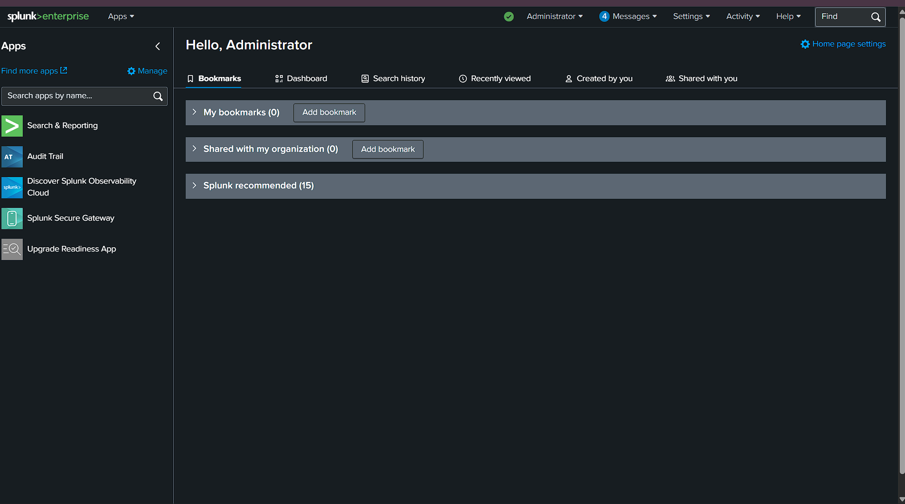
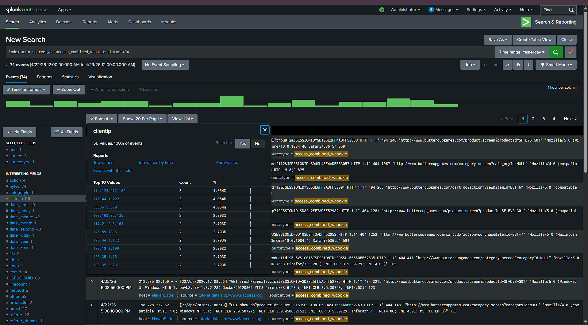

# Splunk Data Analytics: Ethereal Insights & Operational Intelligence
A deep dive into taking raw machine data and transforming it into actionable business intelligence using Splunk Enterprise.

## 🌊 Project Overview
In this project, I acted as a Security/Data Analyst for a fictional e-commerce site. The goal was to ingest raw web traffic logs, identify errors (like 404s), and enrich that data with a product price list to see real-time revenue impact.

### Phase 1: Data Ingestion & Indexing
I started by uploading the raw `tutorialdata.zip` file, ensuring the source types were correctly identified so Splunk could "read" the timestamps and client IPs.

### Phase 2: Identifying Operational Issues
Using SPL (Splunk Processing Language), I filtered the logs to find 404 errors. This helps identify where users are hitting "dead ends" on the site.

### Phase 3: Data Enrichment (The "Boom" Moment)
I uploaded a `Prices.csv` file and created a **Lookup Definition**. This allowed me to match messy `productId` codes with real product names and prices.

## ⚡️ Key Skills Demonstrated
* **Data Enrichment:** Using lookups to join disparate data sources.
* **SPL Proficiency:** Writing complex queries with `stats`, `table`, and `eval`.
* **Visual Analytics:** Creating dashboards to monitor client activity in real-time.
